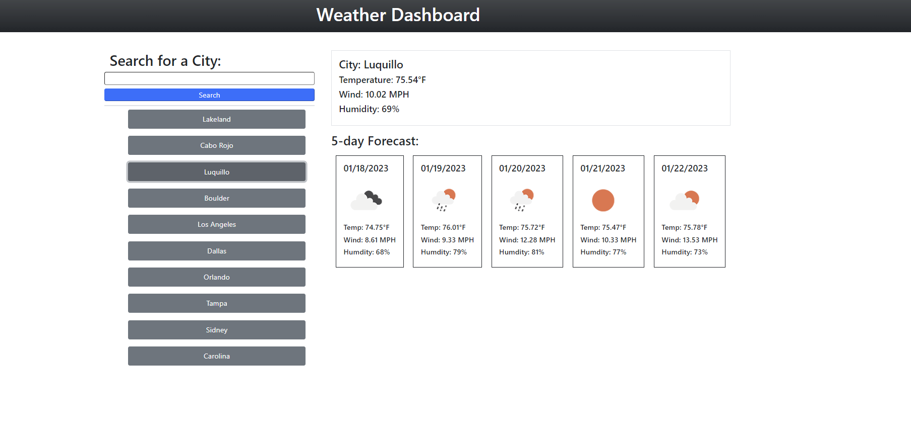

# wheater-dashboard-challenge
This web app present a dashboard where the user can select a city and be presented with a forecast.

# Instructions/Details
Search for a city and the app will return the current day and 5 days worth of weather forecast. Once a city has been queried it will be saved on the sidebar for easy re-selection, however only the last 10 searches will be saved.

Clearing the browser's cache will caused the cities saved will be lost.

# Future development
- Add database to save users and searched cities
- Import weather maps to illustrate weather forecast
- Include ads

# GitHub Repository for JS Weather Forecast App
[Repo](https://github.com/torresorona/weather-dashboard-js)

# JS Weather Forecast App Screenshot
